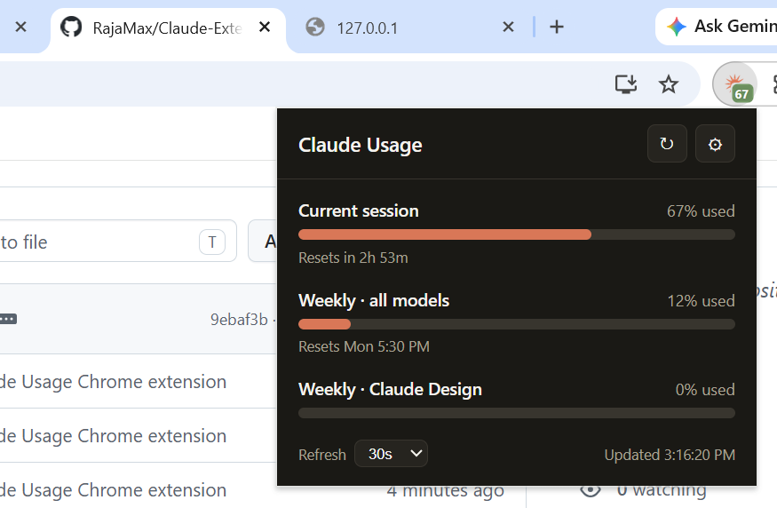

# Claude Usage

A lightweight Chrome extension that shows your **Claude Pro plan usage limits** — current
session, weekly limits, and reset times — in the toolbar, with a live color-coded badge on
the icon. The same numbers you'd see on **claude.ai → Settings → Usage**, one click away.

<p align="center">
  <a href="https://buymeacoffee.com/rajaabines2" target="_blank">
    
  </a>
</p>

> **Unofficial.** This project is not affiliated with, endorsed by, or sponsored by Anthropic.
> It reads your own usage data from claude.ai using your existing login. It relies on an
> **undocumented** claude.ai endpoint, which may change or break at any time.

## Screenshot



## Features

- **Usage bars** for every active limit (Current session, Weekly · all models, and any
  others your plan exposes such as Opus, Sonnet, Claude Code, Claude Design).
- **% used + reset time** per limit. Bars turn amber past 75% and red past 90%.
- **Live toolbar badge** showing the limit you're closest to maxing, color-coded; hover for
  a full breakdown.
- **Configurable auto-refresh** (30s / 1m / 5m / 10m / 30m) from the popup.
- **No API key, no server, no tracking.** Talks only to claude.ai using your own session.

## Install (from source)

1. Download or clone this repo.
2. Open `chrome://extensions` and enable **Developer mode** (top-right).
3. Click **Load unpacked** and select the `extension/` folder.
4. Make sure you're **signed in to claude.ai** in the same browser.
5. Click the extension icon — your usage bars appear, and the icon badge starts updating.

That's it. No key, no configuration. Your organization is auto-detected; you can override it
in **Settings** only if auto-detection picks the wrong one.

## How it works

```
Chrome extension  ──your claude.ai login cookie──▶  claude.ai internal usage API
```

- Endpoint: `GET https://claude.ai/api/organizations/{orgId}/usage`
- `orgId` is auto-detected from `GET https://claude.ai/api/organizations` and cached in
  `chrome.storage.local`.
- Requests use `credentials: "include"`, so your claude.ai cookies are sent.
  `host_permissions` is limited to `https://claude.ai/*`.
- A background service worker polls on your chosen interval (via `chrome.alarms`) and writes
  the badge, even while the popup is closed.

The internal key → label mapping lives in [`extension/shared.js`](extension/shared.js)
(`LIMITS`). If claude.ai changes the response shape, that's the place to update.

## Privacy

This extension collects **nothing** and sends your data **nowhere**. It only reads your own
usage from claude.ai, in your own browser. There is no backend and no analytics.

## Project structure

```
extension/
  manifest.json        MV3 manifest (host_permissions: claude.ai only)
  popup.html/.css/.js  Popup UI: usage bars + interval selector
  shared.js            Usage fetch, org resolution, badge logic (shared)
  background.js        Service worker: alarm-based polling + badge updates
  options.html/.js     Optional organization-ID override
  icons/               Toolbar icons + generate-icons.mjs (regenerates them)
```

## Development

- Plain JS/HTML/CSS — no build step. Edit files and click **↻ reload** on the extension card
  at `chrome://extensions`.
- Regenerate icons: `cd extension/icons && node generate-icons.mjs`.

## Limitations

- Uses an **undocumented** claude.ai API; Anthropic may change it without notice.
- The badge refreshes only while Chrome is open (service workers don't run when it's closed).
- Chrome may not attach your claude.ai cookie to extension-initiated requests on some setups;
  if you see `!` / "Not signed in" while actually logged in, the fetch needs to move into a
  content script running on a claude.ai tab.

## Troubleshooting

- **"Not signed in"** — log in to claude.ai in this browser, then reopen the popup.
- **Wrong org / numbers** — set your Organization ID in **Settings** (find it in the URL on
  `claude.ai/settings/usage`).
- **Nothing renders after a claude.ai update** — open the popup → right-click → Inspect →
  Console; the response shape likely changed.

## Support

If this extension is useful to you, you can support its development:

<p align="center">
  <a href="https://buymeacoffee.com/rajaabines2" target="_blank">
    
  </a>
</p>
